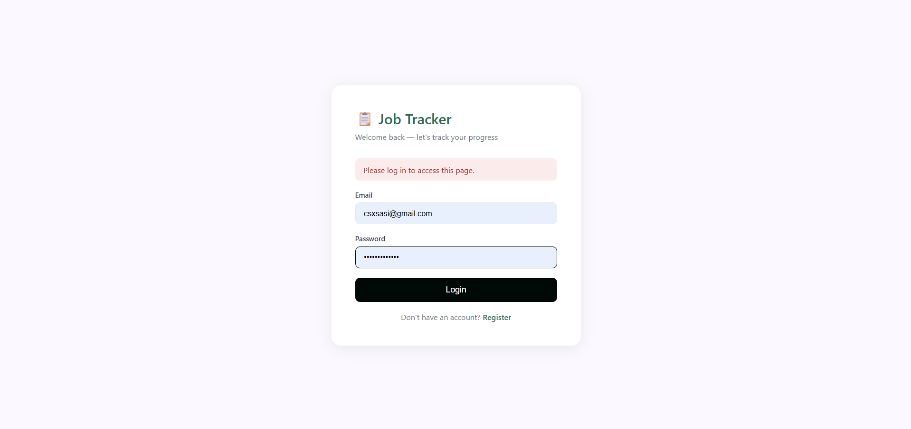
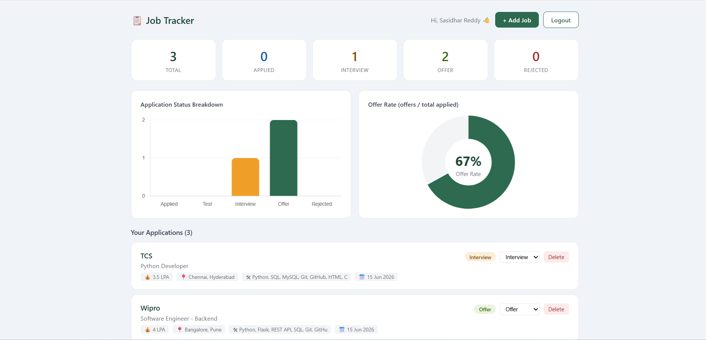
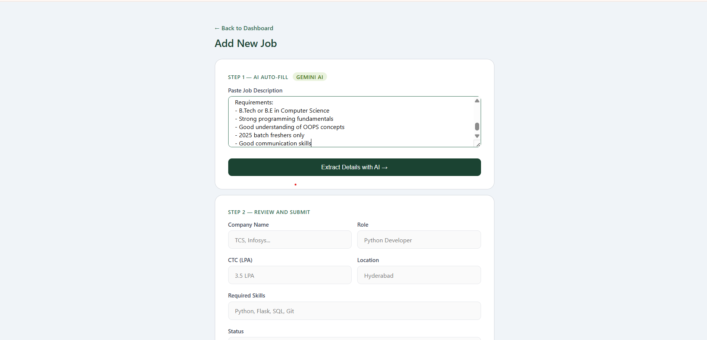

# Job Tracker

A full-stack web app to track your entire placement journey — from application to offer. Built specifically for Indian students navigating campus and off-campus placements.

## The Problem

During placement season, students apply to dozens of companies across spreadsheets, notes apps, and memory. There's no easy way to track application status, see patterns in rejections, or visualize progress — until now.

## Features

- **User Authentication** — secure login and registration with password hashing
- **AI-Powered Job Extraction** — paste any job description and Mistral AI automatically extracts company, role, skills, CTC, and location
- **Visual Dashboard** — bar chart showing application status breakdown and doughnut chart showing offer rate
- **Status Tracking** — move jobs through Applied → Test → Interview → Offer/Rejected
- **Private Data** — each user only sees their own applications
- **Notes** — add personal notes to each application

## Tech Stack

- **Backend:** Python, Flask
- **Database:** MySQL with SQLAlchemy ORM
- **Authentication:** Flask-Login with hashed passwords
- **AI:** Mistral AI API for job description parsing
- **Frontend:** HTML, CSS, JavaScript, Chart.js

## How It Works

1. Register and log in
2. Paste any job description — AI extracts all details automatically
3. Review and add the job to your tracker
4. Update status as you progress through the hiring pipeline
5. View your dashboard to see overall stats and success rate

## Screenshots

### Login Page


### Dashboard


### Add Job with AI Extraction


## Run Locally

Clone the repository:
```bash
git clone https://github.com/Sasidharreddy-03/job-tracker.git
cd job-tracker
```

Create a virtual environment:
```bash
python -m venv venv
venv\Scripts\activate
```

Install dependencies:
```bash
pip install -r requirements.txt
```

Create a MySQL database:
```sql
CREATE DATABASE job_tracker;
```

Create a `.env` file in the root folder:
```
MISTRAL_API_KEY=your_mistral_api_key
DB_USER=root
DB_PASSWORD=your_mysql_password
DB_HOST=localhost
DB_NAME=job_tracker
SECRET_KEY=your_secret_key
```

Run the app:
```bash
python app.py
```
Open `http://127.0.0.1:5000` in your browser.

## Author

Sasidhar Reddy — [LinkedIn](https://www.linkedin.com/in/sasidhar-chinthakunta) | [GitHub](https://github.com/Sasidharreddy-03)
